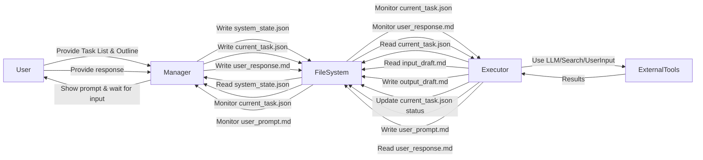

## 제품 요구사항 정의서 (PRD) - 단계별 콘텐츠 생성 Agent 시스템

**1. 개요**

본 문서는 '사용자가 제공한 개요 및 Task List를 기반으로 다양한 유형의 콘텐츠 생성을 자동화하는 Manager/Executor Agent 시스템'의 요구사항을 정의합니다. 시스템은 Manager Agent가 전체 프로세스의 상태를 관리하고 Task를 할당하며, Executor Agent가 할당된 Task를 LLM, 검색 API, 사용자 입력 등의 도구를 활용하여 실제로 수행하는 방식으로 작동합니다.

**2. 목표**

*   사용자가 제공한 콘텐츠 개요 및 Task List를 기반으로 초안 작성부터 최종 결과물까지 전 과정 자동화 지원.
*   콘텐츠 생성 과정의 투명성 확보 및 중간 결과물 확인 용이성 제공 (파일 기반 통신).
*   LLM 및 외부 도구(검색 등)의 활용을 통해 Executor의 작업 능력 확장.
*   사용자 인터랙션 기능을 통해 필요 시 사람의 개입 및 피드백 반영 지원.

**3. 사용자 스토리**

*   **사용자로서,** 콘텐츠 개요와 Task List를 제공하면 시스템이 자동으로 글을 작성하고 중간 결과물을 파일로 확인할 수 있기를 원한다.
*   **사용자로서,** Agent가 작업 중 추가 정보가 필요하면 나에게 질문하고, 내가 답변한 내용을 시스템이 받아서 작업을 이어가기를 원한다.
*   **사용자로서,** 시스템의 현재 진행 상태와 어떤 Task를 수행 중인지 파일에서 쉽게 확인하고 싶다.
*   **시스템으로서,** 제공된 Task List의 순서대로 작업을 진행하고, 각 Task의 입/출력 파일을 관리해야 한다.
*   **시스템으로서,** Executor는 주어진 Task 설명과 입력 파일을 바탕으로 LLM 호출, 검색 등의 작업을 수행하고 결과물을 출력 파일에 저장해야 한다.

**4. 기능 요구사항**

*   **4.1 Task 관리 (Manager)**
    *   입력으로 제공된 Task List (Markdown 또는 JSON 형식)를 파싱해야 한다.
    *   현재 수행 중인 Task의 ID, 설명, 상태(Pending, In Progress, Completed, Failed, WaitingUserInput), 입/출력 파일 경로 등을 포함하는 시스템 상태를 파일로 관리해야 한다.
    *   `system_state.json`과 같은 파일에 시스템 상태를 저장하고 로드하여 작업을 이어서 수행할 수 있어야 한다.
    *   시스템 상태 파일의 상태를 모니터링하며, Executor가 Task 완료 또는 사용자 입력 대기 상태로 변경하면 다음 Task를 결정해야 한다.
    *   다음 Task 실행을 위해 `current_task.json`과 같은 파일에 해당 Task의 상세 정보(ID, 설명, 입력 파일, 출력 파일, Executor 지시사항 등)를 기록하고 Executor에게 알림(파일 업데이트 감지 또는 간단한 플래그 파일 생성 등)을 제공해야 한다.
    *   Task 완료 시 `system_state.json`의 상태를 업데이트하고, 필요한 경우 Task 결과(출력 파일)를 다음 Task의 입력으로 연결해야 한다.
    *   초기 Task 실행 시 빈 콘텐츠 초안 파일을 생성해야 한다.
    *   Task 수행 중 Executor로부터 실패 상태를 전달받으면 이를 기록하고 사용자에게 알릴 수 있어야 한다.
*   **4.2 Task 실행 (Executor)**
    *   `current_task.json` 파일의 업데이트를 감지하고 Task 정보를 읽어야 한다.
    *   Task 정보에 포함된 입력 파일의 내용을 읽어야 한다. (예: 현재까지 작성된 콘텐츠 초안)
    *   Task 설명 및 Executor 지시사항을 기반으로 실제 작업을 수행해야 한다. 이 작업은 LLM 호출, 외부 API(검색) 호출, 사용자 입력 요청 등이 될 수 있다.
        *   **LLM 활용:** 특정 섹션 작성, 기존 텍스트 요약/개선, 문법 교정 등 LLM 모델의 다양한 기능 활용.
        *   **검색 활용:** 특정 정보 조사 (예: Perplexity API, Web Search API 등 외부 검색 API 연동).
        *   **사용자 입력 요청:** 추가 정보 확인 등 (4.3 참조).
    *   작업 결과를 Task 정보에 지정된 출력 파일에 저장해야 한다. (예: 업데이트된 콘텐츠 초안)
    *   작업 완료 또는 상태 변경(예: 사용자 입력 대기) 시 `current_task.json` 파일의 상태를 업데이트하고 Manager에게 알림(파일 업데이트 등)을 제공해야 한다.
    *   작업 중 오류 발생 시 `current_task.json`의 상태를 'Failed'로 변경하고 오류 정보를 기록해야 한다.
*   **4.3 사용자 인터랙션**
    *   **요청:** Executor는 사용자 입력이 필요한 경우 `current_task.json`의 상태를 'WaitingUserInput'으로 변경하고, 사용자에게 전달할 질문 내용을 별도의 파일(예: `user_prompt.md`)에 기록해야 한다.
    *   **처리:** Manager는 `current_task.json`의 상태가 'WaitingUserInput'임을 감지하면 사용자에게 `user_prompt.md` 파일의 내용을 제시하고 응답을 기다려야 한다. (콘솔 출력 및 사용자 입력 대기 또는 사용자에게 파일 수정을 요청하는 방식)
    *   **전달:** 사용자가 응답을 입력(콘솔 또는 파일 수정)하면 Manager는 해당 내용을 별도의 파일(예: `user_response.md`)에 저장하고 `current_task.json`의 상태를 'InProgress' 등으로 변경하여 Executor가 작업을 재개하도록 해야 한다.
*   **4.4 파일 명명 규칙**
    *   시스템 상태 파일: `system_state.json`
    *   현재 Task 정보 파일: `current_task.json`
    *   콘텐츠 초안 파일: `draft_[task_id_before].md`, `draft_[task_id_after].md` 또는 `draft_current.md` (simple mode) 및 `draft_backup_[timestamp].md` (backup mode)
    *   사용자 질문 파일: `user_prompt.md`
    *   사용자 응답 파일: `user_response.md`

**5. 비기능 요구사항**

*   **5.1 로깅:** 시스템 상태 변경, Task 시작/종료, Executor 작업 내용, LLM 호출 정보, 오류 발생 등 주요 이벤트를 기록하는 로깅 기능이 필요하다.
*   **5.2 설정:** LLM 모델, API 키, 검색 API 설정 등을 외부 설정 파일(예: `.env`, `config.yaml`)에서 관리해야 한다.
*   **5.3 오류 처리:** Executor에서 발생하는 API 오류, 파일 I/O 오류 등 기본적인 예외를 처리하고, 실패 상태를 Manager에게 전달해야 한다.
*   **5.4 성능:** 콘텐츠 생성 Task List를 완료하는 데 합리적인 시간 내에 수행되어야 한다. (실시간 작업이 아니므로 높은 성능 요구사항은 없음)

**6. 시스템 아키텍처**

*   **Manager Agent:**
    *   `Task List Reader`: 초기 Task List 파일을 읽어 내부 구조로 로드.
    *   `State Manager`: `system_state.json` 파일 로드/저장, 현재 Task 상태 추적.
    *   `Task Dispatcher`: `system_state.json`을 기반으로 다음 Task 결정, `current_task.json` 파일 생성/업데이트.
    *   `File Monitor`: `current_task.json` 및 `user_response.md` 파일 변경 감지.
    *   `User Interaction Handler`: `user_prompt.md` 내용 사용자에게 제시, 사용자 입력 받아 `user_response.md` 저장.
*   **Executor Agent:**
    *   `Task Reader`: `current_task.json` 파일 읽기, Task 정보 파싱.
    *   `File Handler`: 입력/출력 파일 읽기/쓰기.
    *   `Tool Executor`:
        *   `LLM Adapter`: LLM 모델 호출 및 응답 처리.
        *   `Search Adapter`: 외부 검색 API 호출 및 결과 처리.
        *   `UserInput Adapter`: `user_prompt.md` 생성, `user_response.md` 읽기 (Manager와의 협력).
    *   `State Reporter`: `current_task.json` 파일 상태 업데이트.
*   **Communication Layer:** 파일 시스템 (`.json`, `.md` 파일)을 통한 비동기 통신.
*   **Shared Data:** 콘텐츠 초안 파일 (`.md`).



**7. 데이터 구조 / 파일 형식 상세**

*   **`system_state.json`:**
    ```json
    {
      "current_task_id": "Phase 2-4",
      "status": "InProgress", // Pending, InProgress, Completed, Failed, WaitingUserInput
      "task_list_path": "content_outline.md", // Updated for generality
      "tasks": [ // Parsed task list from input
        {"id": "Phase 1-1", "description": "개요 재확인 및 목표 명확화", ...},
        // ... other tasks ...
        {"id": "Phase 2-4", "description": "서론 작성", "input_draft": "draft_Phase 1-3_after.md", "output_draft": "draft_Phase 2-4_after.md"},
        // ...
      ],
      "draft_current_path": "draft_Phase 2-4_after.md", // Pointer to the latest draft file
      "error_info": null // Or error message if status is Failed
    }
    ```
*   **`current_task.json`:** (Written by Manager, Updated by Executor)
    ```json
    {
      "id": "Phase 2-4",
      "description": "서론 작성",
      "status": "InProgress", // Set by Executor: InProgress, Completed, Failed, WaitingUserInput
      "input_draft_path": "draft_Phase 1-3_after.md",
      "output_draft_path": "draft_Phase 2-4_after.md",
      "executor_instructions": { // Specific instructions for Executor logic
        "action": "write_section",
        "section_title": "서론",
        "context_file": "draft_Phase 1-3_after.md", // Optional: Provide context
        "target_word_count": 300 // Optional hint
      },
      "user_prompt_path": "user_prompt.md", // Used if status becomes WaitingUserInput
      "user_response_path": "user_response.md", // Used after user responds
      "error_message": null // Set by Executor if status is Failed
    }
    ```
*   **`draft_*.md`:** Standard Markdown format for the content. (Changed from blog post content)
*   **`user_prompt.md`:** Markdown format containing the question/message for the user.
*   **`user_response.md`:** Markdown format containing the user's response.

**8. 오픈 문제 / 향후 고려사항**

*   Executor의 Task별 세부 실행 로직(프롬프트 구성, LLM 모델 기능 및 도구 선택 기준) 구체화. (Changed LLM selection criterion)
*   더욱 견고한 오류 처리 및 복구 메커니즘 설계.
*   `system_state.json` 및 `current_task.json` 파일 업데이트 시 파일 잠금(locking) 또는 atomic write 구현 고려 (초기에는 간단하게 시작 가능).
*   Task List 입력 형식에 대한 표준 정의 (Markdown vs. JSON).
*   Executor의 도구 사용 우선순위 및 전략 정의 (언제 LLM을 쓰고, 언제 검색을 할 것인가?).
*   중간 결과물(draft 파일)의 자동 버전 관리 기능 추가.
*   Manager가 Executor의 활동을 감지하는 방식 (파일 변경 감지 vs. 주기적인 폴링). 파일 변경 감지가 효율적이지만 구현 복잡성이 증가할 수 있음. 초기에는 폴링도 고려 가능.

**9. 작업 순서 (Development Roadmap)**

1.  `system_state.json` 기반 Manager의 상태 관리 및 Task 선택 로직 구현.
2.  `current_task.json` 기반 Executor의 Task 정보 읽기 로직 구현.
3.  가장 기본적인 Executor Task 실행 기능 구현 (예: LLM을 이용한 텍스트 생성 - 특정 텍스트를 입력 파일에 추가).
4.  파일 명명 규칙 및 초안 파일 입/출력 연결 구현.
5.  Manager-Executor 간 상태 업데이트 및 파일 기반 통신 구현 (Task 완료 신호).
6.  Task List 파싱 및 `system_state.json` 초기화 로직 구현.
7.  LLM 활용 Executor 기능 확장 (다양한 LLM 기능 연동). (Changed DSPy module integration)
8.  사용자 인터랙션 기능 구현 (질문/답변 파일 연동).
9.  검색 API 연동 Executor 기능 구현.
10. 오류 처리 및 로깅 기능 구현.
11. 설정 관리 기능 구현.
12. Task List의 각 단계별 Executor 실행 로직 구체화 및 통합.
13. 전체 시스템 테스트 및 디버깅.